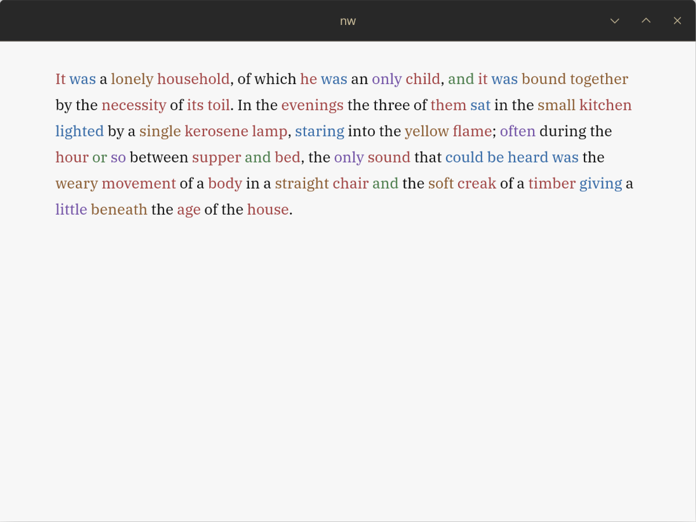

# now_writing

A minimal writing app, with focus mode to minimize distractions.

## ⚠️ Syntax Highlight (Experimental / Unstable)

The current Parts-of-Speech (PoS) syntax highlight implementation is unstable and not ready for regular use yet.

Known issues right now:

- Significant typing/editing lag after short input sessions
- Pasting larger text chunks can introduce heavy UI slowdown
- Focus/syntax cleanup can become inconsistent when moving the caret between paragraphs

## Focus Mode

<table>
  <tr>
    <td align="center">
      
       
      <strong>Focus Mode Disabled</strong>
    </td>
    <td align="center">
      
       
      <strong>Focus Mode Enabled</strong>
    </td>
  </tr>
</table>
